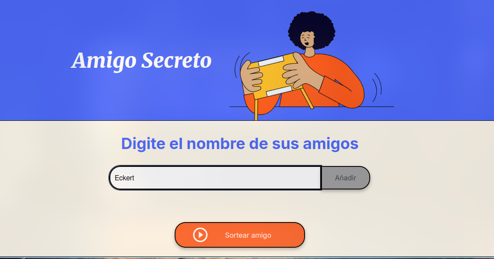
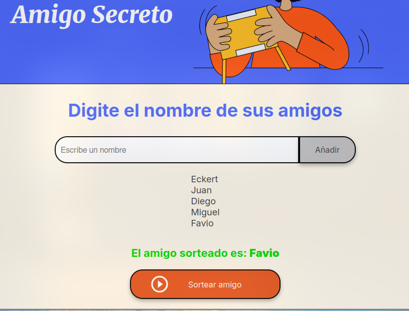

# 🎁 Amigo Secreto

Aplicación web interactiva que permite a los usuarios ingresar nombres de amigos en una lista y realizar un sorteo aleatorio para descubrir quién es el **amigo secreto**.

---

## 📖 Descripción del Proyecto
Este proyecto forma parte de un **challenge de lógica de programación**.  
El flujo de la aplicación es el siguiente:

- **Agregar nombres**: los usuarios pueden escribir nombres en un campo de texto y añadirlos a la lista.  
- **Visualizar la lista**: todos los nombres se muestran en pantalla en forma de lista.  
- **Sortear amigo**: se selecciona aleatoriamente uno de los nombres y se muestra en pantalla como el “amigo secreto”.

---

## 🚀 Estado del Proyecto
- ✅ Funcionalidad básica completa:
  - Agregar nombres.
  - Mostrar lista actualizada.
  - Sortear un amigo de forma aleatoria.
- ⚙️ Mejoras posibles:
  - Evitar nombres duplicados.
  - Opción para eliminar amigos de la lista.
  - Guardar la lista en `localStorage`.

---

## 🖼️ Demostración
### Agregar amigos

### Sortear amigo secreto

---
## 🛠️ Tecnologías utilizadas

- **HTML5**: estructura de la aplicación.  
- **CSS3**: estilos y diseño responsivo.  
- **JavaScript**: lógica de programación y manipulación del DOM.

---

